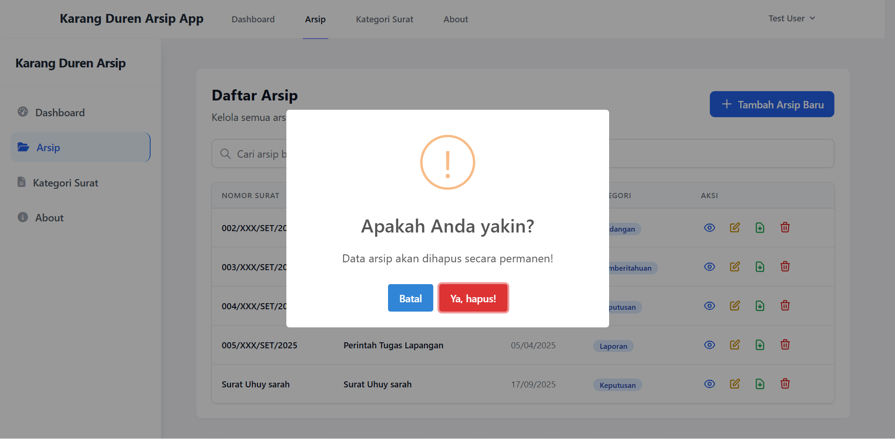

# Karang Duren Arsip App

Sistem informasi arsip surat berbasis web yang dibangun dengan Laravel untuk memudahkan pengelolaan dokumen dan surat di Kelurahan Karang Duren.

## Tujuan Proyek

Aplikasi ini dibuat untuk membantu Kelurahan Karang Duren dalam mengelola arsip surat secara digital. Proyek ini bertujuan untuk:
- Menggantikan sistem pengarsipan manual yang tidak efisien
- Memudahkan pencarian dan pengelolaan dokumen surat
- Menyediakan sistem kategorisasi surat yang terstruktur
- Memberikan kemudahan akses dan keamanan terhadap arsip penting
- Meningkatkan efisiensi dan produktivitas dalam pengelolaan arsip

## Fungsionalitas

Aplikasi ini menyediakan berbagai fitur penting, antara lain:

### Fitur Utama
- **Login dan Otentikasi**: Sistem login aman dengan Laravel
- **Dashboard**: Tampilan ringkasan statistik dan aktivitas terbaru
- **Manajemen Arsip Surat**:
  - Tambah, edit, dan hapus arsip surat
  - Upload file dokumen (PDF, gambar)
  - Pencarian dan filter data arsip
  - Download file arsip
- **Manajemen Kategori Surat**:
  - Pengelolaan kategori surat
  - Hubungan antara kategori dan arsip
- **Fitur Preview Dokumen**:
  - Preview untuk file PDF
  - Preview untuk file gambar
  - Download file asli

### Fitur Tambahan
- Responsive design untuk berbagai ukuran layar
- Notifikasi SweetAlert
- Sistem pencarian real-time
- Statistik dan informasi jumlah data

## Petunjuk Penggunaan

### Prasyarat
- PHP 8.2 atau lebih tinggi
- Composer
- Database (MySQL, PostgreSQL, atau SQLite)
- Node.js dan npm (untuk asset management)

### Instalasi

1. **Clone repository**:
   ```bash
   git clone <repository-url>
   cd arsip-app
   ```

2. **Install dependencies PHP**:
   ```bash
   composer install
   ```

3. **Install dependencies JavaScript**:
   ```bash
   npm install
   npm run dev
   ```

4. **Buat file environment**:
   ```bash
   cp .env.example .env
   ```

5. **Generate application key**:
   ```bash
   php artisan key:generate
   ```

6. **Konfigurasi database**:
   - Atur koneksi database di file `.env`
   - Contoh untuk MySQL:
     ```
     DB_CONNECTION=mysql
     DB_HOST=127.0.0.1
     DB_PORT=3306
     DB_DATABASE=arsip_app
     DB_USERNAME=your_username
     DB_PASSWORD=your_password
     ```

7. **Jalankan migrasi**:
   ```bash
   php artisan migrate --seed
   ```

8. **Jalankan server**:
   ```bash
   php artisan serve
   ```

### Konfigurasi Email (opsional)
Jika Anda ingin fitur notifikasi email:
1. Atur SMTP di file `.env`
2. Pastikan konfigurasi mail sudah benar

## Tampilan Aplikasi

Berikut adalah beberapa screenshot dari aplikasi Karang Duren Arsip:

### Dashboard

*Dashboard utama aplikasi*


*Tampilan ringkasan statistik*

### Halaman Login

*Halaman autentikasi pengguna*

### Manajemen Arsip

*Daftar arsip surat*


*Form penambahan arsip surat*


*Tampilan detail arsip surat*


*Form edit arsip surat*

### Manajemen Kategori

*Daftar kategori surat*


*Form penambahan kategori surat*


*Tampilan detail kategori surat*


*Form edit kategori surat*

### Tentang Aplikasi

*Halaman informasi tentang aplikasi*

### Fitur Notifikasi

*Contoh notifikasi konfirmasi penghapusan*

## Struktur Proyek

- `app/Http/Controllers/` - File controller untuk menangani logika aplikasi
- `resources/views/` - File template Blade untuk tampilan aplikasi
- `database/migrations/` - File migrasi database
- `database/seeds/` - File seeder untuk data awal
- `public/storage/` - File upload yang dapat diakses publik

## Teknologi yang Digunakan

- **Backend**: Laravel (PHP Framework)
- **Frontend**: Blade Template, Tailwind CSS, JavaScript
- **Database**: MySQL (dapat dikonfigurasi)
- **Authentication**: Laravel Fortify atau Breeze
- **File Upload**: Laravel Storage
- **PDF Viewer**: Built-in browser PDF viewer
- **Image Preview**: Built-in browser image viewer

## Kontribusi

Kontribusi sangat diterima! Silakan ikuti langkah berikut:
1. Fork repository
2. Buat branch fitur (`git checkout -b feature/NamaFitur`)
3. Commit perubahan (`git commit -m 'Add some NameFeature'`)
4. Push ke branch (`git push origin feature/NamaFitur`)
5. Buat pull request
